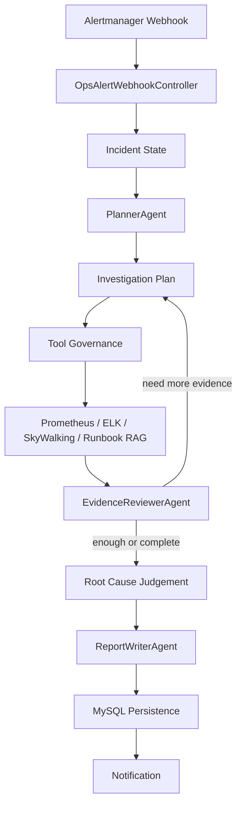

# Ops AutoAgent Diagnosis

Ops AutoAgent Diagnosis is a Spring Boot and Spring AI based incident diagnosis framework for observability-driven operations. It turns an Alertmanager alert into a stateful multi-agent investigation: planning, governed tool calls, evidence collection, evidence review, reflection-based supplemental collection, root-cause judgement, report writing, persistence and notification.

## What It Does

- Receives Alertmanager webhooks and normalizes incident context.
- Initializes incident state so repeated evidence collection and review rounds share the same context.
- Uses three independent ChatClient agents: PlannerAgent, EvidenceReviewerAgent and ReportWriterAgent.
- Collects evidence from Prometheus, Elasticsearch, SkyWalking and Runbook RAG.
- Applies tool governance with allowlists, call budgets, failure fallback and tool-call logging.
- Reviews evidence sufficiency and triggers supplemental collection only when useful.
- Persists incident state, investigation plans, reviews, tool logs, diagnosis records, notifications and evaluation metrics.
- Provides an evaluation harness for root-cause hit rate, evidence coverage, tool coverage, RAG Top-K recall, diagnosis latency and multi-agent path checks.

## Architecture



## Modules

- `ops-autoagent-app`: Spring Boot application, configuration and MyBatis mapper resources.
- `ops-autoagent-api`: external API contracts.
- `ops-autoagent-trigger`: HTTP controllers for alerts, manual diagnosis, mock faults and evaluation.
- `ops-autoagent-domain`: agent orchestration, rule-tree workflow, planning, reviewing, memory and evaluation logic.
- `ops-autoagent-infrastructure`: database repositories and external gateways for Prometheus, Elasticsearch, SkyWalking, MCP and Runbook RAG.
- `ops-autoagent-types`: shared response and exception types.

## Core Code Paths

- Rule-tree execution: `ops-autoagent-domain/src/main/java/com/opsautoagent/domain/ops/service/OpsIncidentExecuteStrategy.java`
- Strategy factory: `ops-autoagent-domain/src/main/java/com/opsautoagent/domain/ops/service/factory/DefaultOpsAgentExecuteStrategyFactory.java`
- Template execution support: `ops-autoagent-domain/src/main/java/com/opsautoagent/domain/ops/service/execute/AbstractOpsAgentExecuteSupport.java`
- Root node: `ops-autoagent-domain/src/main/java/com/opsautoagent/domain/ops/service/execute/OpsRootNode.java`
- Agent prompts and ChatClient orchestration: `ops-autoagent-domain/src/main/java/com/opsautoagent/domain/ops/agent`
- Tool governance: `ops-autoagent-domain/src/main/java/com/opsautoagent/domain/ops/agent/governance`
- Runbook RAG: `ops-autoagent-infrastructure/src/main/java/com/opsautoagent/infrastructure/adapter/gateway/ops`
- Evaluation harness: `ops-autoagent-domain/src/main/java/com/opsautoagent/domain/ops/agent/eval`

## Requirements

- JDK 17
- Maven 3.8+
- MySQL 8+
- PostgreSQL with pgvector
- Optional: Prometheus, Elasticsearch, SkyWalking and Grafana for full-chain verification
- An OpenAI-compatible chat API and embedding API

## Configuration

The repository does not contain real API keys. Configure them through environment variables or update your local database after importing SQL.

Common environment variables:

```powershell
$env:OPENAI_BASE_URL = "https://api.openai.com"
$env:OPENAI_API_KEY = "your-chat-api-key"
$env:OPENAI_CHAT_MODEL = "gpt-4o-mini"

$env:OPS_RUNBOOK_EMBEDDING_BASE_URL = "https://api.openai.com"
$env:OPS_RUNBOOK_EMBEDDING_API_KEY = "your-embedding-api-key"
$env:OPS_RUNBOOK_EMBEDDING_MODEL = "text-embedding-3-small"

$env:MYSQL_URL = "jdbc:mysql://127.0.0.1:13306/ops-autoagent-diagnosis?useUnicode=true&characterEncoding=utf8&serverTimezone=Asia/Shanghai&useSSL=false&allowPublicKeyRetrieval=true"
$env:MYSQL_USERNAME = "root"
$env:MYSQL_PASSWORD = "123456"

$env:PGVECTOR_URL = "jdbc:postgresql://127.0.0.1:15432/ai-rag-knowledge"
$env:PGVECTOR_USERNAME = "postgres"
$env:PGVECTOR_PASSWORD = "postgres"
```

The clean SQL seed uses `${OPENAI_API_KEY:}` style placeholders in `ai_client_api`. `AiClientApiNode` resolves those placeholders from environment variables at startup.

## Database

Import all SQL files under:

```text
docs/dev-ops/mysql/sql
```

Important files:

- `ops_chat_client_config.sql`: clean ChatClient tables and safe seed data for PlannerAgent, EvidenceReviewerAgent and ReportWriterAgent.
- `ops_tool_policy.sql`: tool allowlist and budget policies.
- `ops_eval_harness.sql`: evaluation cases and metrics tables.
- `ops_historical_incident_memory.sql`: long-term incident memory table.

## Build

```powershell
$env:JAVA_HOME = "D:\Java\jdk17"
$env:Path = "$env:JAVA_HOME\bin;$env:Path"
mvn -q -DskipTests compile
```

## Run

```powershell
mvn -pl ops-autoagent-app -am spring-boot:run -Dspring-boot.run.profiles=full
```

Health check:

```powershell
Invoke-RestMethod -Method Get -Uri http://127.0.0.1:8099/actuator/health
```

## Main Endpoints

- Alertmanager webhook: `POST /api/v1/ops/alert/webhook/alertmanager`
- Manual diagnosis: `POST /api/v1/ops/incident/analyze`
- Diagnosis record: `GET /api/v1/ops/incident/record/{diagnosisId}`
- Full-chain verification: `POST /api/v1/ops/verify/full-chain`
- Evaluation run: `POST /api/v1/ops/evaluation/run`
- Single evaluation case: `POST /api/v1/ops/evaluation/run/{caseId}`
- Runbook RAG evaluation: `POST /api/v1/ops/evaluation/runbook-rag/run`
- Runbook RAG ablation: `POST /api/v1/ops/evaluation/runbook-rag/ablation`
- Memory and toolchain summary: `GET /api/v1/ops/evaluation/memory-toolchain/summary`

## Security Notes

- Do not commit real API keys, email authorization codes, database passwords or production endpoint credentials.
- Runtime files, build outputs and local application data are ignored by `.gitignore`.
- Third-party runtime agents should be installed locally and referenced through environment variables instead of being committed into this repository.

